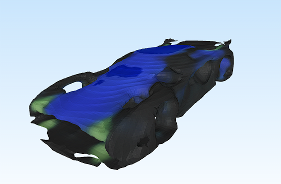

# Assets3D

A Text-to-3D generator that creates assets for scenery and environmental design.

Model for prompt "a_futuristic_sports"

Model for prompt "rusted_broadsword_broken_hilt"

## Setup

pip install -r requirements.txt

python setup_shap_e.py

## Run

**Web Interface:**
python web_viewer.py

Open: `http://localhost:5000`

**CLI:**
python main.py

CUDA recommended
